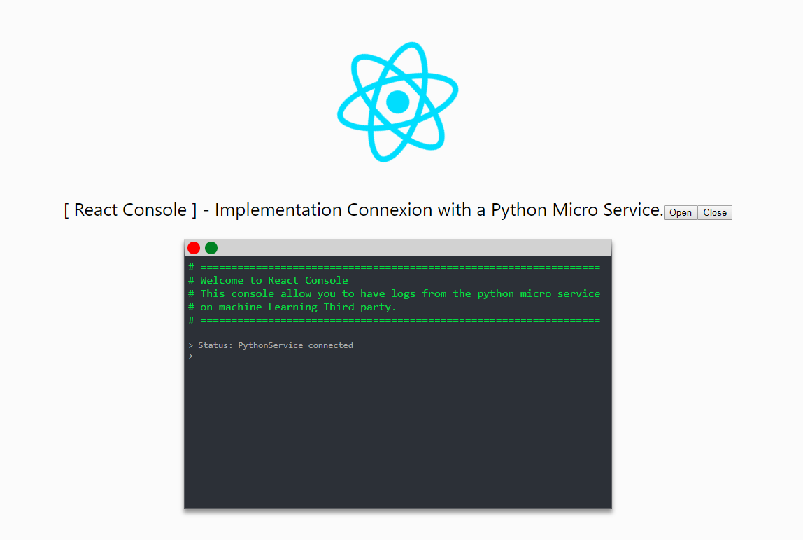

# React Console.

An Implementation of a connexion with a Python Microservice

## Installation && Deployment

```shell
# To install
cd to/the/project
npm install

# To launch
npm start
# Or
yarn start

# The app should be available on http://localhost:3000/

# For extras feature like closing or open the terminal just use thee class
.close to close the terminal
.open to open the terminal
```

## How to use
```js
import EchoConsole from './EchoConsole/EchoConsole'
```

```html
<!-- Pass the socket server url to EchoConsole -->
<EchoConsole socket_server = "http://192.168.56.1:5000"/>

<!-- Close and open the console with open/close classes -->
<button className="open">Open</button>
<button className="close">Close</button>
```

## Render



## Author

- [Sanix darker](https://github.com/Sanix-Darker)
